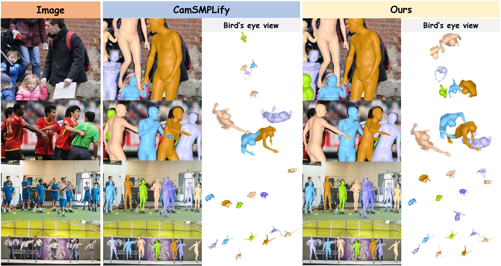
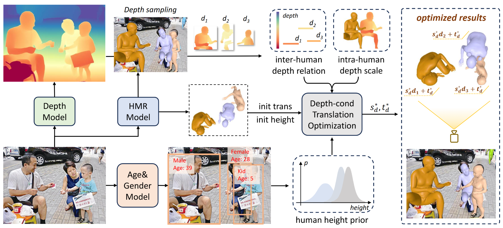

# DTO-Humans

[](http://arxiv.org/abs/2511.13282)
[](https://drive.google.com/drive/folders/1ddc43P6iYIctAvmuravIxbxZm3F2uB41?usp=drive_link)
[](https://github.com/gouba2333/MA-HMR)

This repository contains the official implementation of DTO framework and DTO-Humans dataset for the paper *Towards Metric-Aware Multi-Person Mesh Recovery by Jointly Optimizing Human Crowd in Camera Space*.



## 🚀 DTO Framework & DTO-Humans Dataset


We introduce Depth-conditioned Translation Optimization (DTO), a novel optimization-based method that jointly refines the camera-space translations of all individuals in a crowd. By leveraging anthropometric priors on human height and depth cues from a monocular depth estimator, DTO solves for a scene-consistent placement of all subjects within a principled Maximum a posteriori (MAP) framework. Applying DTO to the 4D-Humans dataset, we construct DTO-Humans, a new large-scale pGT dataset of 0.56M high-quality, scene-consistent multi-person images, featuring dense crowds with an average of 4.8 persons per image.

**Download DTO-Humans from [Google Drive](https://drive.google.com/drive/folders/1ddc43P6iYIctAvmuravIxbxZm3F2uB41?usp=drive_link) | [Tsinghua Cloud](https://cloud.tsinghua.edu.cn/d/539173c2952b40f5a422/)**

## ⚙️ Installation

### 1. Create Conda Environment
We recommend using Conda to manage the dependencies.

```bash
conda create -n dto python=3.10
conda activate dto
```

### 2. Install PyTorch
Install PyTorch and torchvision compatible with CUDA 12.4. Please adjust for your specific CUDA version if necessary.

```bash
pip install torch==2.6.0 torchvision==0.21.0 --index-url https://download.pytorch.org/whl/cu124
```

### 3. Install Detectron2 and PyTorch3D from Source
```bash
# Install Detectron2
git clone https://github.com/facebookresearch/detectron2.git
cd detectron2
pip install -e . --no-build-isolation
cd ..

# Install PyTorch3D
git clone https://github.com/facebookresearch/pytorch3d.git
cd pytorch3d
pip install -e . --no-build-isolation
cd ..
```

### 4. Install Remaining Dependencies

```bash
pip install -r requirements.txt
```

### 5. Install OSMesa for Offscreen Rendering
OSMesa is needed for mesh visualization without a display server. This is for Debian/Ubuntu-based systems.

```bash
sudo apt-get update && sudo apt-get install libosmesa6-dev libglu1-mesa
```

### 🔧 Troubleshooting & Common Issues

*   **`glGetError` in rendering mesh:** This is often caused by a `libstdc++` conflict within the Conda environment. You can fix it by linking to the system's library.
    ```bash
    # Replace ${Your_Conda_Environment} with the path to your conda env, e.g., ~/miniconda3/envs/dto
    rm ${Your_Conda_Environment}/lib/libstdc*
    ln -s /usr/lib/x86_64-linux-gnu/libstdc++.so.6.0.30 ${Your_Conda_Environment}/lib/libstdc++.so
    ln -s /usr/lib/x86_64-linux-gnu/libstdc++.so.6.0.30 ${Your_Conda_Environment}/lib/libstdc++.so.6
    ```
    *Note: The version `6.0.30` might differ on your system. Use the one available in `/usr/lib/x86_64-linux-gnu/`.*

*   **`ImportError: cannot import name 'OSMesaCreateContextAttribs'`:** This can be solved by installing a specific version of PyOpenGL.
    ```bash
    pip install PyOpenGL==3.1.4
    ```
*   **Errors related to `chumpy` package:** You might need to manually patch the `chumpy` package. Please follow the instructions provided in this guide:
    [**Fix Chumpy Guide**](https://github.com/ChiSu001/SAT-HMR/blob/main/docs/fix_chumpy.md)

## 📦 Data and Pre-trained Models

Please download the required models and data and place them in the specified directory structure.

### SMPL Models
Download the SMPL models and place them in `data/models/smpl/`. Partially Available at [this link](https://drive.google.com/drive/folders/1C8fZNiiZfC1oMUZq7xNilQcGv4LJf5M8?usp=drive_link). You need to register on the [SMPL website](https://smpl.is.tue.mpg.de/) to get other part of them.

```
data/
└── models/
    └── smpl/
        ├── J_regressor_extra.npy
        ├── smpl_mean_params.npz
        ├── SMPL_NEUTRAL.pkl
        ├── SMPL_to_J19.pkl
        └── SMPLA_NEUTRAL.pth
```

### Pre-trained Checkpoints
Download all checkpoints and place them in the `ckpt/` directory.

```
ckpt/
├── model_final_f05665.pkl        # DET Model from https://camerahmr.is.tue.mpg.de/
├── camerahmr_checkpoint_cleaned.ckpt # HMR Model from https://camerahmr.is.tue.mpg.de/
├── cam_model_cleaned.ckpt        # CAM Model from https://camerahmr.is.tue.mpg.de/
├── depth_anything_v2_vitl.pth    # Depth Model from https://github.com/DepthAnything/Depth-Anything-V2
└── yolov8x_person_face.pt        # Face Detection Model from https://github.com/WildChlamydia/MiVOLO
```

## ▶️ Running the Code

### Quick Demo
To run the DTO framework on a sample image:

1.  **First Step: Initial Inference**
    This step generates initial SMPL parameters using CameraHMR.
    ```bash
    python inference_init.py --image_folder demo
    ```

2.  **Second Step: DTO Optimization**
    This step runs the main optimization loop to refine the 3D mesh.
    ```bash
    python dto_framework.py --dataset demo --vis_step 1
    ```

### Test on RelativeHuman Dataset

1.  **Data Preparation**
    Download RelativeHuman dataset from [Relative_Human](https://github.com/Arthur151/Relative_Human) and place as follows:
    ```
    data/
    └── RelativeHuman/
        ├── images/
        └── test_annots.npz
    ```

2.  **Run DTO**
    ```bash
    # Step 1: Generate initial predictions
    python inference_init.py --image_folder data/RelativeHuman/images --annots_path data/RelativeHuman/test_annots.npz --chmr_file_path data/relativehuman_test.npz

    # Step 2: Run DTO optimization and visualize results every 50 steps
    python dto_framework.py --dataset rh --vis_step 50
    ```

## 🌐 Reproducing & Visualizing DTO-Humans

### Data Preparation for DTO-Humans
First, download the image datasets and the corresponding `.npz` annotation files from the [CameraHMR project page](https://camerahmr.is.tue.mpg.de/). Organize them as shown below. The `*_CHMR_SMPL_OPT.npz` files are our DTO-Humans annotations.

```
data/
├── aic/
│   ├── images/
│   ├── aic-release.npz
│   └── AIC_CHMR_SMPL_OPT.npz
├── coco2014/
│   ├── images/
│   │   └── train2014/
│   ├── coco-release.npz
│   └── COCO_CHMR_SMPL_OPT.npz
├── insta/
│   ├── images/
│   │   └── insta-train/
│   ├── insta1-release.npz
│   ├── insta2-release.npz
│   └── INSTA_CHMR_SMPL_OPT.npz
└── mpii/
    ├── images/
    ├── mpii-release.npz
    └── MPII_CHMR_SMPL_OPT.npz
```

### Reproducing DTO-Humans Annotations
Run the DTO framework for each dataset to generate our optimized annotations. The results will be saved as `*_opt.npz` in the respective dataset directories. Simple reorgnizing leads to `*_CHMR_SMPL_OPT.npz`

```bash
python dto_framework.py --dataset insta1 --save_all_annots False
python dto_framework.py --dataset insta2 --save_all_annots False
python dto_framework.py --dataset coco --save_all_annots False
python dto_framework.py --dataset mpii --save_all_annots False
python dto_framework.py --dataset aic --save_all_annots False
```

### Visualizing DTO-Humans Annotations
To visualize a few samples from our generated DTO-Humans dataset (e.g., 20 samples from COCO):

```bash
python visualize_dto.py --dataset coco --vis_num 20
```

## 📜 License

The code and the DTO-Humans dataset are released under the [**Creative Commons Attribution-NonCommercial 4.0 International License**](https://creativecommons.org/licenses/by-nc/4.0/). This means they are available for **non-commercial academic research purposes only**. Please see the [LICENSE](LICENSE) file for the full license text.


## 📜 Citation
If you find our work useful, please consider citing our paper:

```bibtex
@article{wang2025dtohumans,
  title={Towards Metric-Aware Multi-Person Mesh Recovery by Jointly Optimizing Human Crowd in Camera Space},
  author={Kaiwen Wang, Kaili Zheng, Yiming Shi, Chenyi Guo, Ji Wu},
  journal={arXiv preprint arXiv:2511.13282},
  year={2025}
}
```

## 🙏 Acknowledgements

This project builds upon several amazing open-source projects and datasets. We would like to thank the authors of:
*   [RelativeHuman](https://github.com/Arthur151/Relative_Human)
*   [4D-Humans](https://github.com/shubham-goel/4D-Humans?tab=readme-ov-file)
*   [CameraHMR](https://camerahmr.is.tue.mpg.de/)
*   [Depth Anything V2](https://github.com/DepthAnything/Depth-Anything-V2)
*   [MiVOLO](https://github.com/WildChlamydia/MiVOLO)
*   [ViTPose](https://github.com/ViTAE-Transformer/ViTPose)
*   [Detctron2](https://github.com/facebookresearch/detectron2)